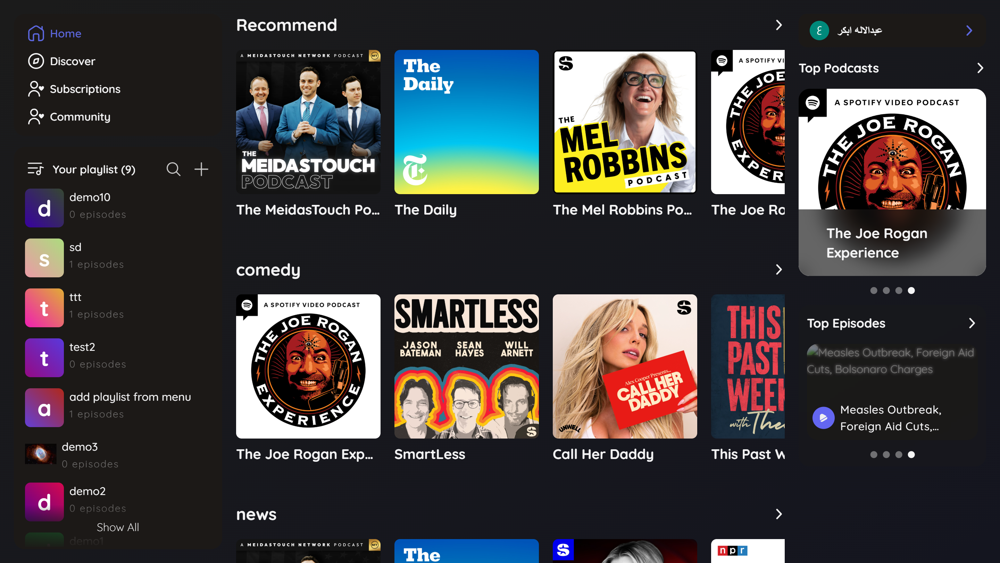
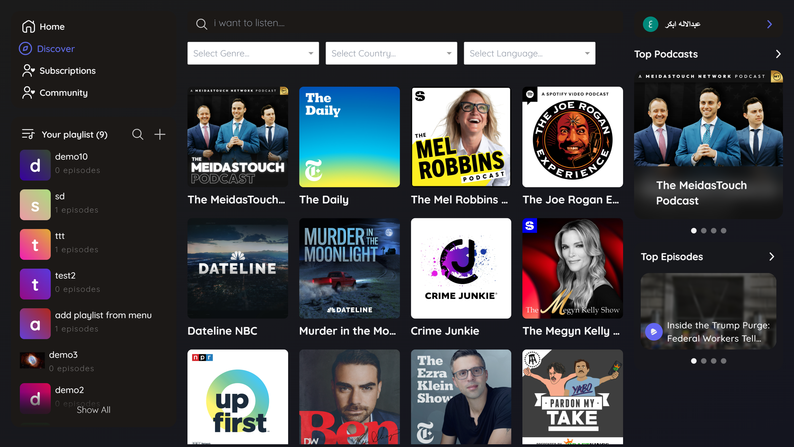

# 🎙️ 🎧 PoMic - Your Ultimate Podcast Streaming Platform

Welcome to **PoMic** – a comprehensive fully functional podcast streaming
platform for discovering, streaming, and managing your favorite audio content
together in one seamless experience!!! 🚀

## 🌟 Features

### 🏠 Home Page

- Showcases **popular podcasts** for quick access.
- Easy navigation to **discover new content**.

### 🔍 Discover Page

- **Advanced Search** by:
  - Podcast name 🎧
  - Genre 🎭
  - Language 🌍
  - Country 🌍

### 👤 User Authentication

- **Login, Signup, and Logout** functionalities for a personalized experience.

### 📌 Profile Page

- View your **subscribed podcasts**.
- Access your **podcast history**.
- Manage your **playlists** and **favorite podcasts**.

### 📂 Playlist Management

- Create, edit, and manage **custom playlists**.
- Left-side navigation bar lists **user playlists** for easy access.

### 📊 Top Podcasts & Episodes

- **Top 4 Podcasts** slider with a link to the full **Top Podcasts** page.
- **Top Episodes** slider with a link to the **Top Episodes** page.

### 🎯 Intuitive UI & Navigation

- Left bar: **Navigation menu & user playlists**.
- Right bar: **Go-to-profile button & featured podcast sliders**.

### 📱 Responsive Design

- Seamless experience across devices
- Optimized for mobile, tablet, and desktop viewing

### 🛠️ Tech Stack

This project is built using the following technologies:

- React ⚛️ – For building the UI components.

- TailwindCSS 🎨 – For styling and a modern responsive design.

- Clerk 🔑 – For authentication and user management.

- Appwrite with GraphQL 🗄️ – For database management and backend services.

- React-Howler 🎵 – For controlling the audio playback.

## 🚀 How to Run the Project

1. **Clone the Repository**

   ```sh
   git clone https://github.com/Abdulelah-Abacar/pomic.git
   cd pomic
   ```

2. **Install Dependencies**

   ```sh
   npm install  # or yarn install
   ```

3. **Environment Variables** Create a `.env` file in the root directory:

   ```
   VITE_APP_TADDY_URI=https://api.taddy.org/
   VITE_APP_TADDY_USER_ID=
   VITE_APP_TADDY_API_KEY=
   VITE_DATABASE_ID=appwrite database id
   VITE_COLLECTION_ID_PLAYLIST=appwrite collection id
   VITE_PROJECT_ID=appwrite project id
   VITE_CLERK_PUBLISHABLE_KEY=
   ```

4. **Run the Project**

   ```sh
   npm run dev
   ```

5. Open your browser and visit: `http://localhost:5173`

## 🎯 Use Cases

✅ **Casual Listeners** – Easily find and enjoy trending podcasts 🎶.  
✅ **Podcast Enthusiasts** – Build and manage playlists, explore different
genres 🎼.  
✅ **Language Learners** – Discover podcasts in different languages to enhance
learning 📚.

## 📸 Screenshots

### Home page

  <p align="center">
    
    
  </p>
  
  ### Discover page
  <p align="center">
    
    
  </p>

## 🌍 Go to Live Demo

Check out the live project here: [Live Demo](YOUR_PROJECT_URL) 🚀

## 💡 Future Enhancements

🔹 Podcast Recommendations 🤖  
🔹 Social Sharing Features 📢

## 🤝 Contributing

Contributions are welcome! Feel free to open an issue or submit a pull request.
Let's build something amazing together! ✨

---

🎧 Happy Streaming! 🚀
